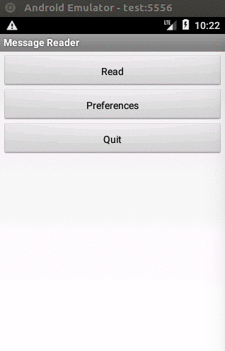

# Reader

## Table of Contents
### [Overview](#overview)
### [Deploying and Running the Application](#deploying-and-running-the-application)
### [Running Tests](#running-tests)
### [Application Design](#application-design)
### [Code Quality Analysis](#code-quality-analysis)
### [Developer Notes](#developer-notes)
#### [Creating an Android Project](#creating-an-android-project)
#### [Android Emulator](#android-emulator)
### [Final Notes](#final-notes)

<a name="overview"/>

## Overview

Reader is a simple android app whose purpose is to showcase my Scala/Android development skills.
 
The app downloads messages from JSON files served by a remote server and loads the messages on a scrollable list.

If a message's text is a link, the app will attempt to render it as an image and display it.

One can also change the app's configuration through a "Preferences" screen.

<a name="deploying-and-running-the-application"/>

## Deploying and Running the Application

To deploy the application to the device:

    sbt clean android:install

To deploy the application and run:

    sbt clean android:install

You will need to connect to an emulator or an actual Android phone connect to your computer's USB port.
You will find some tips on the development's section.

<a name="running-tests"/>

## Running Tests

Currently, this project supports the following tests:

* Unit Tests (regular [`ScalaTest`](http://www.scalatest.org/) tests using `FunSuite`).

* Instrumented Tests (using [`AndroidTest`](https://developer.android.com/training/testing/start/index.html), which 
require the emulator or an actual Android device).

* UI Tests (using `AndroidTest`, also require emulator or actual device).

To run unit tests, execute the following command:

    sbt clean test

To run both instrumented and UI tests, execute the following command:

    sbt clean android:test

<a name="application-design"/>

## Application Design

As much as I would like to use Scala for the whole project, a few components (particularly in tests) needed to be 
developed in Java to guarantee compatibility with Android's APIs. For one, ScalaTest is not compatible with the 
latest AndroidTest APIs.

Even though there are many HTTP clients available in Scala, I couldn't find one fully compatible with Android,
therefore using a Java one (more details in the next section).

<a name="third-party-libraries"/>

## Third-party Libraries

I have chosen [macroid](https://github.com/47deg/macroid) for Android UI development, which consists of a library of 
Scala macros for Android UI creation.

You will find some documentation on macroid's Scala macros (including examples) 
[here](http://47deg.github.io/macroid/docs/).

After experimenting with a couple of different options, among them [scaloid](https://github.com/pocorall/scaloid),
I feel like macroid is the best option at the moment in terms of popularity and compatibility with the newest Android 
APIs (for one, scaloid, it's stronger competitor, only supports the old Android APIs).

Macroid doesn't have as many features as scaloid yet though (`PreferenceActivity` for instance, are not supported at 
the moment).

For fetching HTTPS resources, I have initially chosen [dispatch](http://dispatch.databinder.net/Dispatch.html), but it
seems like isn't compatible with Android (from version 0.8 onwards), and for this reason, I have opted for the 
[Apache HttpClient](https://hc.apache.org/httpcomponents-client-ga/index.html), which seems the most reliable option
for this purpose at the moment.

For JSON serialization, I'm using [json4s](https://github.com/json4s/json4s) which seem fully compatible with Android.

I would prefer to use Scala, but I don't think is advisable to use a library that can no longer be updated.

For fetching online images, I have chosen [Picasso](http://square.github.io/picasso/), which seem nicer than 
[Facebook's Fresco](https://github.com/facebook/fresco) and 
[Droidparts's Image Fetcher](http://droidparts.org/image_fetcher.html) (which has been discontinued by the way).

I specially like Picasso's strait forward way to setup a place holder and error image.

For mocking HTTPS endpoints I have chosen [Wiremock](http://wiremock.org/), which even though is Java, is the most 
robust choice at the moment (also I'm only using it in the unit tests).

UI tests can be slow, so as the application and the test suite grows, might be necessary to use mock-ups to make tests 
faster.

For the instrumented and UI tests, I'm using [Raw Git](https://rawgit.com) to serve the test JSON files available in
 this project's Git repository. Tests files are available under `src/test/resources/reader`.

<a name="code-quality-analysis"/>

## Code Quality Analysis

I always run IntelliJ's `Analyze > Inspect Code` before I commit any code. I'm also using 
[scalastyle-sbt-plugin](http://www.scalastyle.org/sbt.html). This project includes a `scalastyle` config: 
`./scalastyle-config.xml`

To run analysis, execute the following command:

      sbt scalastyle

<a name="developer-notes"/>

## Developer Notes

I'm putting the steps required to create an android development environment in this section for my own reference.
That was the first time I had to setup a development environment, so I might as well save the information for future 
use while it's fresh in my memory.

<a name="creating-an-android-project"/>

### Creating an Android Project

I'm using [sbt-android](https://github.com/scala-android/sbt-android) for this purpose.

You can use the plugin not only for build and invoking tests, but also to generate a template project.
You will need to install the plugin globally in this case.

Create the file `~/.sbt/0.13/plugins/android.sbt`:

With the following contents:

    addSbtPlugin("org.scala-android" % "sbt-android" % "1.7.6")

Then in a terminal, type the following to create a brand new Android/Scala project:

    gen-android <package name> <project name>

Example:

    gen-android com.wire.reader reader

If you have an Android SDK installed, you should have the environment variables `ANDROID_HOME` and `ANDROID_NDK_HOME` 
set in your `.bashrc` file. If you don't, `sbt-android` will download the latest available version for you and install
it under `~/.android/sbt/sdk` as they are needed.

<a name="android-emulator"/>

### Android Emulator

#### Install the Emulator

You may use `sdkmanager` to install the emulator. Execute the following command to get a list of what's already 
installed:

    ~/.android/sbt/sdk/tools/bin/sdkmanager --list

You might need to change the command's path accordingly if you have previously installed your Android SDK.

If `emulator` isn't present on the list, execute the following command:

    ~/.android/sbt/sdk/tools/bin/sdkmanager emulator

#### Install Emulator's Dependencies

Google Android APIs:

    ~/.android/sbt/sdk/tools/bin/sdkmanager "system-images;android-24;google_apis;x86_64"

Or (depending on your system):

    ~/.android/sbt/sdk/tools/bin/sdkmanager "system-images;android-24;google_apis;x86"

Android Platform:

    ~/.android/sbt/sdk/tools/bin/sdkmanager "platforms;android-23"

Change according with the platform you want to develop for.

#### Create an Android Virtual Device

    ~/.android/sbt/sdk/tools/bin/avdmanager \
    create avd \
    --package "system-images;android-24;google_apis;x86_64" \
    --tag google_apis \
    --name test

Change according to the platform you need and specify a name for the emulator. In this example, the emulator is
named "test".

#### Running the Emulator

    ~/.android/sbt/sdk/tools/emulator -avd test

You will need to start the emulator in a separated terminal before running Android instrumented and UI tests.

For the emulator's log file, execute the following command:

    ~/.android/sbt/sdk/platform-tools/adb logcat

If you have multiple devices (e.g., the emulator and an actual android phonen connected to the USB port is a common 
thing), you need to specify the device. To list the devices, execute the following command:

     ~/.android/sbt/sdk/platform-tools/adb devices -l

You should get a list of devices as follows:

     List of devices attached
     emulator-5556          device product:sdk_google_phone_x86_64 model:Android_SDK_built_for_x86_64 device:generic_x86_64
     emulator-5554          offline

Then execute the `adb` command specifying its id:

     ~/.android/sbt/sdk/platform-tools/adb -s model:Android_SDK_built_for_x86_64 logcat

#### Running in an Actual Device

You will find full instructions [here](https://developer.android.com/studio/run/device.html). In a nutshell, you need
to create a configuration file named `/etc/udev/rules.d/51-android.rules` with the following contents:
     
     SUBSYSTEM=="usb", ATTR{idVendor}=="04e8", MODE="0666", GROUP="plugdev"

You will find the value for `idVender` [here](https://developer.android.com/studio/run/device.html#VendorIds).

In the example, `idVendor` is "04e8".

#### Deleting Files in the Internal Storage

You might need to delete files created by your app in the internal storage. You will need  `adb` root access:

     ~/.android/sbt/sdk/platform-tools/adb -s model:SM_G920F shell root

Once you have root access, you may use the shell to run UNIX commands on the emulator/device, e.g.:

     ~/.android/sbt/sdk/platform-tools/adb -s model:Android_SDK_built_for_x86_64 ls /data/data
     
     ~/.android/sbt/sdk/platform-tools/adb -s model:Android_SDK_built_for_x86_64 rm -rf /data/data/com.wire.reader

<a name="final-notes"/>

## Final Notes

For my own reference, I used [peek](https://github.com/phw/peek/releases) for generating a `*.gif` from my app in action.

**TODO:**
 
 * Add support to [ACRA](https://github.com/ACRA/acra/wiki/BasicSetup) for easier debugging and crash monitoring.
 * Find a way to inject dependencies using different profiles (development, production, test, etc), so one can safely use
 mock-ups in tests.
 * Coverage reports with [sbt-scoverage](https://github.com/scoverage/sbt-scoverage).