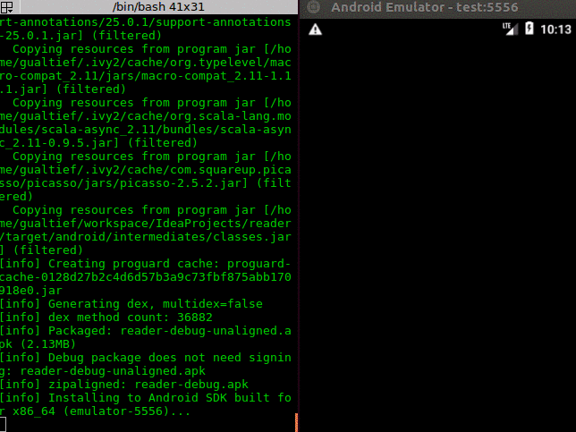

# Reader

## Table of Contents
### [Overview](#overview)
### [Deploying and Running the Application](#deploying-and-running-the-application)
### [Running Tests](#running-tests)
### [Design](#design)
### [Code Quality Analysis](#code-quality-analysis)
### [Developer Notes](#developer-notes)
#### [Creating an Android Project](#creating-an-android-project)
#### [Emulator](#emulator)
### [Final Notes](#final-notes)

<a name="overview"/>

## Overview

Reader is a simple android app whose purpose is to showcase my Scala/Android development skills.

The app downloads messages from JSON files served by a remote server and loads them on a scrollable list. If a message's
text is a link, the app will attempt to render it as an image and display it.

One can also change the app's configuration through a "Preferences" screen.

Despite the app's simplicity (feature-wise), the project itself aims to cover all engineering requirements to 
create production ready Android code. It includes unit tests, android tests (instrumentation and UI), code style check 
and coverage reports (TODO).

<a name="deploying-and-running-the-application"/>

## Deploying and Running the Application

To deploy the application to the device:

    sbt clean android:install

To deploy the application and run it:

    sbt clean android:run

>***Note:***
>You will need to connect to an emulator or an actual Android phone connect to your computer's USB port.
>You will find some tips in the [Developer Notes](#developer-notes) section.

You may also only generate a `*.apk` package without deploying it to the device:

     sbt clean android:package

<a name="running-tests"/>

## Running Tests

Currently, this project supports the following tests:

* Unit Tests (regular [`ScalaTest`](http://www.scalatest.org/) tests using `FunSuite`).

* [Android Tests](https://developer.android.com/training/testing/start/index.html) (Instrumented and UI tests), which 
require an emulator or an actual Android device. This project only has UI tests at the moment. You will find further
instructions in the [Android Emulator](#android-emulator) section.

To run unit tests, execute the following command:

    sbt clean test

To run UI tests, execute the following command:

    sbt clean android:test

For the UI tests, I'm using [Raw Git](https://rawgit.com) to serve the test JSON files available in this project's Git 
repository. Tests files are available under `src/test/resources/reader`.

Raw Git will serve these files at `https://rawgit.com/marciogualtieri/reader/master/src/test/resources/reader`, e.g.:

     https://rawgit.com/marciogualtieri/reader/master/src/test/resources/reader/0.json
     https://rawgit.com/marciogualtieri/reader/master/src/test/resources/reader/1.json
     https://rawgit.com/marciogualtieri/reader/master/src/test/resources/reader/3.json

<a name="application-design"/>

## Design

The application is composed of the following components:

<!---
custom_mark3
interface MessageFetcher {}
/**
 *@composed 1 Has 1 HttpClient
 */
class HttpMessageFetcher implements MessageFetcher {}
class HttpClient {}
interface MessageSerializer {}
class JsonMessageSerializer implements MessageSerializer {}
class PreferencesEditor {}
/**
 *@composed 1 Has 1 MessageFetcher
 *@composed 1 Has 1 MessageSerializer
 *@composed 1 Has 1 PreferencesEditor
 */
class MainActivity {}
/**
 *@composed 1 Has 1 PreferencesEditor
 */
class PreferencesActivity {}
custom_mark3
-->

I have defined abstractions for both the `MessageFetcher` and `MessageSerializer` as a feel like these are likely to 
change. 

For instance, we might want to use a different protocol from HTTP to fetch the messages or we might want to use a REST 
service to serve messages instead of JSON files. We may also decide to serialize messages using something else than 
JSON ([Avro](https://avro.apache.org/), [Protobuffer](https://developers.google.com/protocol-buffers/), etc).

Message objects are defined as follows:

<!---
custom_mark2
/**
*@opt all
*/
class Message {
    public String id;
    public String text;
    public Long timestamp;
    public Long index;
    Message(String id, String text, Long timestamp, Long index);
}
custom_mark2
-->

Each field maps to a field in the JSON message, excepting `index` which represents the index of the page the message was
fetched from (`0.json`, `1.json`, `2.json`, etc).

I have decided to not cache the JSON files from the server. Instead, I stored the index of the last page fetched by the
app (offset), so I don't need to fetch them again. Even though the user can go to preferences and reset the offset back
to a page already loaded (e.g., 0). Messages displayed are stored in internal storage (file `messages.json`).

>***Note:***
>Default values for the endpoint's URL and offset are stored in `assets/reader.properties`.
>It's a bit awkward to type an URL in an Android keyboard, therefore you might want to change it to something else in
the properties file before you deploy.

<a name="third-party-libraries"/>

## Third-party Libraries

At the moment, unit tests are fully written in Scala, while production code is a mix of Scala and Java (mostly Scala).
Android tests are fully in Java.

For UI development, I have chosen [macroid](https://github.com/47deg/macroid), which consists of a library of Scala 
macros for Android UI creation. You will find some documentation on macroid's Scala macros (including examples) 
[here](http://47deg.github.io/macroid/docs/).

After researching a couple of different options, among them [scaloid](https://github.com/pocorall/scaloid),
I feel like macroid is the best option at the moment in terms of popularity and compatibility with the newest Android 
APIs (for one, scaloid, it's stronger competitor, doesn't support the newest Android APIs).

Macroid doesn't have as many features as scaloid yet though (`PreferenceActivity` for instance, is not supported at 
the moment).

For fetching HTTPS resources, I have initially chosen [dispatch](http://dispatch.databinder.net/Dispatch.html), but it
seems like isn't compatible with Android 
([from version 0.8 onwards](http://dispatch-classic.databinder.net/Dispatch+in+Android.html)). For this reason I have 
opted for the [Apache HttpClient](https://hc.apache.org/httpcomponents-client-ga/index.html), which seems the most 
reliable option for this purpose available right now.

For JSON serialization, I'm using [json4s](https://github.com/json4s/json4s) which seem fully compatible with Android.

For fetching online images, I have chosen [Picasso](http://square.github.io/picasso/), which seem a bit nicer than 
other options, such as [Facebook's Fresco](https://github.com/facebook/fresco) and 
[Droidparts's Image Fetcher](http://droidparts.org/image_fetcher.html) (which has been discontinued by the way).

I specially like Picasso's strait forward way to setup a place holder and error image.

For mocking HTTPS endpoints I have chosen [Wiremock](http://wiremock.org/), which even though is Java, is the most 
robust choice at the moment (I'm only using it in the unit tests at the moment). UI tests can be slow, so as the 
application and the test suite grows, might be necessary to use mock-ups to speed them up.

<a name="code-quality-analysis"/>

## Code Quality Analysis

I always run IntelliJ's `Analyze > Inspect Code` before I commit any code. I'm also using 
[scalastyle-sbt-plugin](http://www.scalastyle.org/sbt.html). This project includes a `scalastyle` config: 
`./scalastyle-config.xml`

To run analysis, execute the following command:

      sbt scalastyle

<a name="developer-notes"/>

## Developer Notes

I'm putting the steps required to create an android development environment in this section for my own reference.
That was the first time I had to setup a development environment, so I might as well save the information for future 
use while it's fresh in my memory.

<a name="creating-an-android-project"/>

### Creating an Android Project

I'm using [sbt-android](https://github.com/scala-android/sbt-android) for this purpose.

You can use the plugin not only for build and invoking tests, but also to generate a template project (you will need to 
install the plugin globally in this case).

Create the file `~/.sbt/0.13/plugins/android.sbt` with the following contents:

    addSbtPlugin("org.scala-android" % "sbt-android" % "1.7.6")

Then in a terminal, type the following to create a brand new Android/Scala project:

    gen-android <package name> <project name>

Example:

    gen-android my.package.name my_project_name

If you have an Android SDK installed, you should have the environment variables `ANDROID_HOME` and `ANDROID_NDK_HOME` 
set in your `.bashrc` file. If you don't, `sbt-android` will download the latest available version of the SDK for you 
and install it under `~/.android/sbt/sdk` as they are needed.

<a name="android-emulator"/>

### Emulator

#### Install

You may use `sdkmanager` to install the emulator. Execute the following command to get a list of what's already 
installed:

    ~/.android/sbt/sdk/tools/bin/sdkmanager --list

You might need to change the command's path according with the location of your SDK.

If `emulator` isn't present on the list, execute the following command:

    ~/.android/sbt/sdk/tools/bin/sdkmanager emulator

#### Dependencies

Google Android APIs:

    ~/.android/sbt/sdk/tools/bin/sdkmanager "system-images;android-24;google_apis;x86_64"
    ~/.android/sbt/sdk/tools/bin/sdkmanager "system-images;android-24;google_apis;x86"

*Change according with the operating system you are using for development.*

Android Platform:

    ~/.android/sbt/sdk/tools/bin/sdkmanager "platforms;android-24"

*Change according with the platform you want to develop for.*

#### Create an Android Virtual Device

    ~/.android/sbt/sdk/tools/bin/avdmanager \
    create avd \
    --package "system-images;android-24;google_apis;x86_64" \
    --tag google_apis \
    --name test

*Change according with the API and platform used. In this example, the emulator is named "test".*

#### Running

    ~/.android/sbt/sdk/tools/emulator -avd test

You will need to run the emulator in a separated terminal before running Android instrumented and UI tests.

For the emulator's log file, execute the following command:

    ~/.android/sbt/sdk/platform-tools/adb logcat

If you have multiple devices (e.g., the emulator and an actual android phone connected to the USB port is a common 
scenario), you might need to specify the device. To list the devices, execute the following command:

     ~/.android/sbt/sdk/platform-tools/adb devices -l

You should get a list of devices as follows:

     List of devices attached
     emulator-5556          device product:sdk_google_phone_x86_64 model:Android_SDK_built_for_x86_64 device:generic_x86_64
     emulator-5554          offline

Then execute the `adb` commands specifying the id, e.g.:

     ~/.android/sbt/sdk/platform-tools/adb -s model:Android_SDK_built_for_x86_64 logcat

#### Running in an Actual Device

You will find full instructions [here](https://developer.android.com/studio/run/device.html). In a nutshell, you need
to create a configuration file named `/etc/udev/rules.d/51-android.rules` with the following contents:
     
     SUBSYSTEM=="usb", ATTR{idVendor}=="04e8", MODE="0666", GROUP="plugdev"

You will find the value for `idVender` [here](https://developer.android.com/studio/run/device.html#VendorIds).

In this example `idVendor` is "04e8".

#### Deleting Files in the Internal Storage

You might need to delete files created by your app in the internal storage. You will need  `adb` root access:

     ~/.android/sbt/sdk/platform-tools/adb -s model:Android_SDK_built_for_x86_64 root

Once you have root access, you may use the shell to run UNIX commands on the emulator or device, e.g.:

     ~/.android/sbt/sdk/platform-tools/adb -s model:Android_SDK_built_for_x86_64 ls /data/data
     ~/.android/sbt/sdk/platform-tools/adb -s model:Android_SDK_built_for_x86_64 shell rm -rf /data/data/my.package.name

<a name="final-notes"/>

## Final Notes

For my own reference, I used [peek](https://github.com/phw/peek) for generating a `*.gif` from my app in action.

**TODO:**
 
 * Add support to [ACRA](https://github.com/ACRA/acra/wiki/BasicSetup) for easier debugging and crash monitoring.
 * Find a way to inject dependencies using different profiles (development, production, test, etc), so one can safely use
 mock-ups in tests.
 * Coverage reports with [sbt-scoverage](https://github.com/scoverage/sbt-scoverage).
 * ScalaStyle seems to get confused with some of macroid's macros, so some checks will fail for macroid code when
 executing `sbt scalastyle`. It doesn't seem to affect IntelliJ though.
 * Add more UI tests.
 * Port AndroidTests to Scala.
 * For now the screens are small (and therefore activities are small), but might be worth to extract view and action 
 code into separated classes for viewers and controllers.
